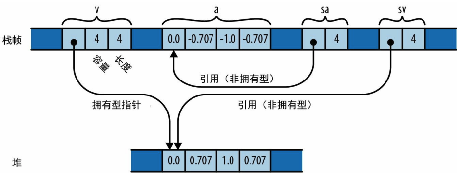

## 引用
在Java中，一个对象永远不会包含其它对象的实际内容，且对象一定会分配到堆中。

rust中的引用跟Java中的引用不同，引用的对象可以位于**栈**或堆中。

`&x`是对x变量的引用，它**借用**了对x的引用。

```rust
fn main() {
    let mut num = 100;
    // r 是 num变量的mut引用
    let r = &mut num;

    // *r 获取引用的值
    println!("{}", *r); // 100

    // 修改引用的值，修改的值直接体现在变量上
    *r = 200;
    println!("{}", num) // 200
}
```
rust的引用永远不会为空。在**编译期**就能排除悬空指针，双重释放和指针时效等错误。

#### &T
一个**不可变**的**共享**引用

#### &mut T
一个**可变**的、**独占**的引用

### Box
在堆中分配值的最简单方式是使用`Box::new`。
```rust
fn main() {
    // 变量t完全在栈中，整个元组的所有数据都存储在栈上，没有堆内存分配。
    let t = (12, "apple");
    // 变量b是在栈中，但它指向堆中的元组
    let b = Box::new(t);
    // Box::new会在堆上分配足够的空间以容纳此元组。Box::new(t) 会做两件事:
    // 1. 在堆上分配一块内存，把元组 t 的数据（12 和 "apple" 的切片信息）完整拷贝到堆上
    // 2. 创建一个 Box 类型的变量 b, 指向堆上的元组数据。
}
```

## 数组
```rust
fn main() {
    // 定义6个 u8 元素的数组
    let arr: [u8; 6] = [1, 2, 3, 4, 5, 6];
    // 数组的大小是类型的一部分，是在编译器就已经确定的常量。
    // 不能向数组中追加元素或缩小数组。

    println!("{}", arr[2]); // 3
    println!("{}", arr.len()); // 6

    // 定义一个长度是100的bool类型的数组，其值都是true
    let flags: [bool; 100] = [true; 100];
    println!("{}", flags.len()); // 100

    // 定义1KB的缓冲区
    let buffer: [u8; 1024] = [0; 1024];

    // Rust 没有任何能定义未初始化数组的写法
    // 数组的长度不能是变量，当你需要一个长度在运行期可变的数组时，请改用Vector。
}
```
这段代码里定义的所有数组（arr、flags、buffer），它们的存储空间全部分配在栈上。
## Vector
Vector是一个可以动态调整大小的列表，Vector存储空间是在**堆**上分配的。
```rust
fn main() {
    // vec!宏创建Vector，看起来像数组，但是Vector，存储空间是在堆上
    let mut nums: Vec<i32> = vec![1, 2, 3, 4, 5, 6];
    nums.push(7);
    nums.push(8);
    println!("{:?}", nums); // [1, 2, 3, 4, 5, 6, 7, 8]

    // 创建Vector的另一种方式
    let mut fruits: Vec<&str> = Vec::new();
    fruits.push("apple");
    fruits.push("banana");
    fruits.push("pear");
    println!("{:?}", fruits); // ["apple", "banana", "pear"]

    // 从迭代器生成一个Vector
    let v: Vec<i32> = (0..5).collect();
    println!("{:?}", v); // [0, 1, 2, 3, 4]

    // len 方法返回当前包含的元素数量
    println!("{}", v.len()); // 5
    // capacity 方法返回不重新分配的情况下可以容纳的元素数
    println!("{}", v.capacity()); // 5
}
```

Vec<T> 由 3 个值组成：指向元素在堆中分配的缓冲区的指针、缓冲区能够存储的元素数量，以及它现在实际包含的数量。

当缓冲区达到其最大容量时，往向量中添加另一个元素需要分配一个更大的缓冲区，将当前内容复制到其中，更新向量的指针和容量以指向新缓冲区，最后释放旧缓冲区。如果事先知道向量所需的元素数量，就可以调用`Vec::with_capacity`而不是`Vec::new`来创建一个向量，它的缓冲区足够大，可以从一开始就容纳所有元素。然后，可以逐个将元素添加到此向量中，而不会导致任何重新分配。

可以在向量中任意位置插入元素和移除元素，不过这些操作会将受影响位置之后的所有元素向前或向后移动，因此如果向量很长就可能很慢：
```rust
fn main() {
    let mut v: Vec<i32> = (0..5).collect();
    println!("{:?}", v); // [0, 1, 2, 3, 4]

    v.insert(1, 100);
    println!("{:?}", v); // [0, 100, 1, 2, 3, 4]

    v.remove(2);
    println!("{:?}", v); // // [0, 100, 2, 3, 4]

    // pop方法从Vec<T>中弹出一个值会返回Option<T>。
    // 如果向量已经为空则为None，如果其最后一个元素为v则为Some(v)。
    loop {
        let val: Option<i32> = v.pop();
        if val == None {
            println!("stack is empty");
            return
        }
        println!("the top value is {}", val.expect("不会发生错误"))
    }
}
```

## Slice
切片是数组或向量中的一个**区域**。由于切片可以是任意长度，因此它不能直接存储在变量中或作为函数参数进行传递。切片总是通过**引用**传递。

对切片的引用是一个胖指针：一个双字值，包括**指向切片第一个元素的指针**和**切片中元素的数量**。
```rust
let v: Vec<f64> = vec![0.0, 0.707, 1.0, 0.707];
let a: [f64; 4] = [0.0, -0.707, -1.0, -0.707];
// Rust 自动把 &Vec<f64> 的引用和 &[f64; 4] 的引用转换成了直接指向数据的切片引用
let sv: &[f64] = &v;
let sa: &[f64] = &a;
```
这段代码的内存布局如下：



切片的引用是指向内存中一系列**连续值**的**非拥有**型指针。

你以为属于向量或数组的许多方法其实是在切片上定义的，比如会对元素序列进行排序或反转的 sort 方法和 reverse 方法实际上是切 片类型 [T] 上的方法。

```rust
fn main() {
    let arr: [i32; 6] = [1, 2, 3, 4, 5, 6];
  	// 使用范围值对数组或向量进行索引，以获取一个切片的引用
    let slice: &[i32] = &arr[1..4];
    println!("{:?}", slice); // [2, 3, 4]
}
```


