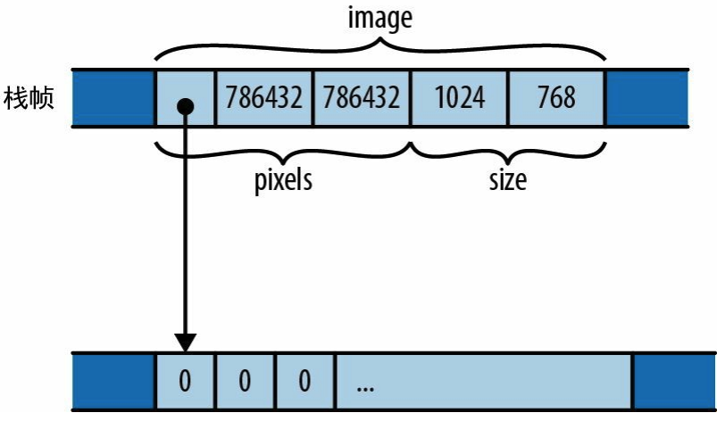

# 结构体

有3种类型的结构体：**具名字段型结构体**、**元组型结构体**、**单元型结构体**。

## 具名字段型结构体

```rust
fn main() {
    let obj1 = GrayscaleMap {
        pixels: vec![1, 2, 3, 4],
        size: (3, 4),
    };

    let pixels: Vec<u8> = vec![5, 6, 7];
    let size: (usize, usize) = (3, 4);
    let obj2 = GrayscaleMap { pixels, size };
    // 表达式 GrayscaleMap { pixels, size } 是 GrayscaleMap { pixels: pixels, size: size } 的简写形式
}

struct GrayscaleMap {
    pixels: Vec<u8>,
    size: (usize, usize),
}
```

结构体默认情况下是**私有**的，仅在声明它的模块及其子模块中可见。你可以通过在结构体的定义前加上 pub 来使结构体在其模块外部可见。

结构体中的每个字段默认情况下也是私有的，即使一个结构体声明为pub，它的字段也可以是私有的。

GrayscaleMap 值在内存中的布局：



可以使用另一个**相同类型**的结构体为新的结构体赋值，但会导致move的发生：

```rust
fn main() {
    let person1 = Person {
        name: "Jack".to_string(),
        age: 22,
    };
    let person2 = Person{..person1};

    println!("{}", person2.name);  // Jack
    println!("{}", person2.age);   // 22

    // Value used after being moved
    // println!("{}", person1.name);
}

struct Person {
    name: String,
    age: u8,
}
```

## 元组型结构体

```rust
fn main() {
    let pair = Pair(3, 4);

    println!("{}", pair.0);  // 3
    println!("{}", pair.1);  // 4
}

struct Pair(i32, i32);
```

## 单元型结构体

声明了一个根本没有元素的结构体类型，它是一种只有一个值的类型：

```rust
struct Onesuch;
```

## impl块

```rust
fn main() {
    let mut stack: Stack<u8> = Stack::new();

    // 下面虽然直接使用了变量本身，但其实会转换成对应的引用。，
    stack.push(1);
    stack.push(2);
    stack.push(3);
    stack.push(100);
    let value = stack.pop();
    println!("{}", value.expect("get value"));

    println!("{}", stack.size());
}

// 泛型T
struct Stack<T> {
    data: Vec<T>,
}

// Rust将结构体的方法放在单独的impl块中
impl<T> Stack<T> {
    // 没有self参数，相当于静态方法
    pub fn new() -> Stack<T> {
        Stack { data: vec![] }
    }

    pub fn push(&mut self, element: T) {
        self.data.push(element)
    }

    pub fn pop(&mut self) -> Option<T> {
        return self.data.pop();
    }

    pub fn size(&self) -> usize {
        return self.data.len();
    }
}
// 这里的&self、&mut self 是 self: &Stack 或 self: &mut Stack 的简写形式。
// 方法不要直接接受变量本身作为参数，一定要用引用作为参数，否则所有权会被转移。
```

