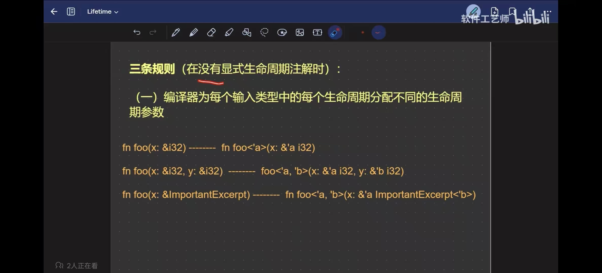
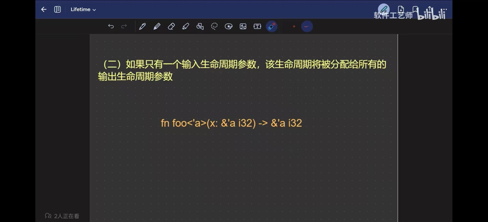
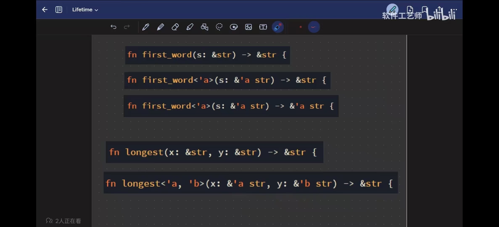
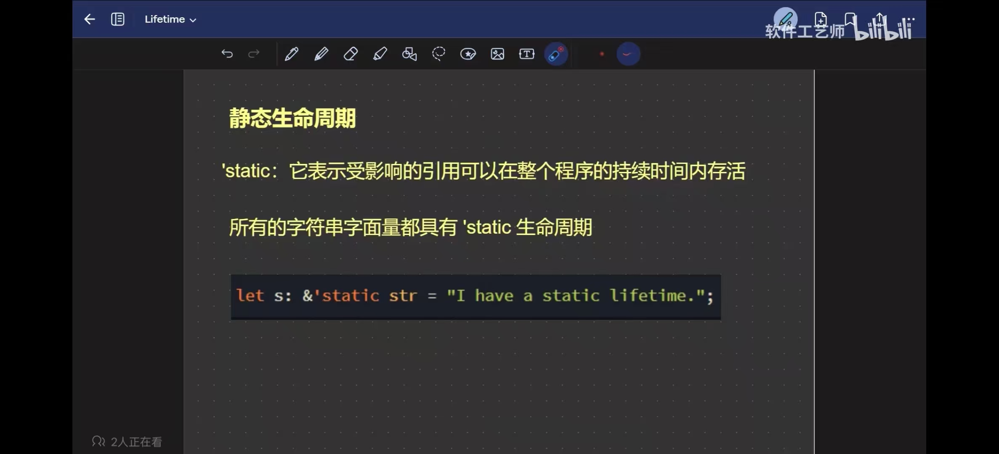
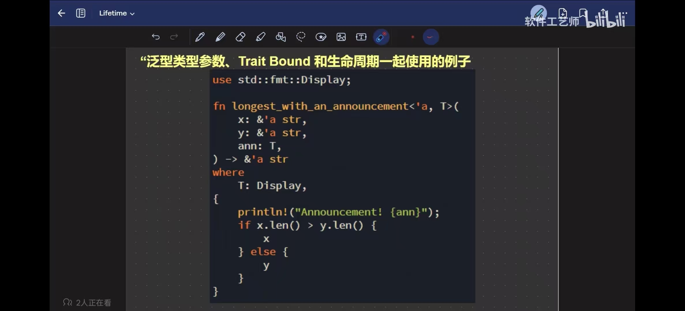

# 生命周期参数

下面的方法会报错：
```rust
// Missing lifetime specifier
fn longest(s1: &str, s2: &str) -> &str {
    if s1.len() > s2.len() {
        s1
    } else {
        s2
    }
}
// 此时编译器无法推导出返回值的生命周期
```

指定参数和返回值的生命周期参数：
```rust
fn main() {
    let s1 = "long string ~~~~~".to_string();
    {
        let s2 = "short str".to_string();
        let result = longest(&s1, &s2);
        println!("result: {}", result);
    }

}

// s1和s2的生命周期参数相同，所以这里的'a参数表示的生命周期只能是s1和s2的交集，返回值的生命周期也只能在这个交集中
fn longest<'a>(s1: &'a str, s2: &'a str) -> &'a str {
    if s1.len() > s2.len() {
        s1
    } else {
        s2
    }
}
```

## 为什么很多方法无需明确指定生命周期参数？
因为rust编译器会增加默认的生命周期参数









```rust
// 再回来看下这个方法，这个方法没有指定生命周期参数
// 所以compiler会为s1和s2默认分配不同的生命周期参数，返回值的声明周期参数没法指定，此时如果再不明确指定返回值的生命周期就会报错
fn longest(s1: &str, s2: &str) -> &str {
    if s1.len() > s2.len() {
        s1
    } else {
        s2
    }
}
```