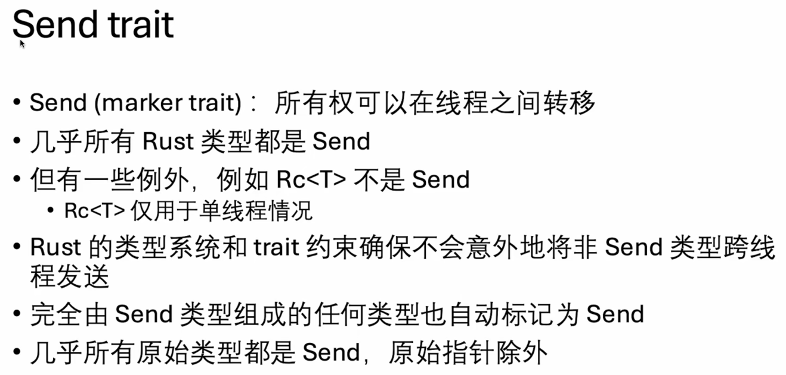
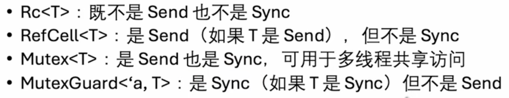
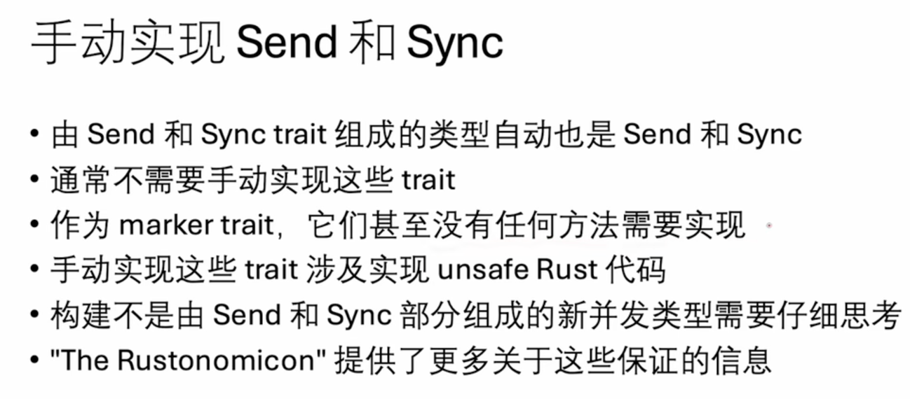

# 线程

Rust中标准库使用`1:1`的线程实现模型，即Rust语言中的一个线程对应操作系统中的一个线程。

thread::spawn接受一个闭包作为参数，会创建一个新的线程执行闭包中的code：
```rust
use std::thread;
use std::time::Duration;

fn main() {
    thread::spawn(|| {
        for i in 1..10 {
            println!("number {} from the spawned thread!", i);
            thread::sleep(Duration::from_millis(10));
        }
    });

    for i in 1..10 {
        println!("number {} from the main thread!", i);
        thread::sleep(Duration::from_millis(10));
    }

    // 如果主Thread退出了，即使子Thread没执行完，进程也会立刻退出，这里等待2s给子线程一些时间
    thread::sleep(Duration::from_millis(2000));
}
```

### join

```rust
fn main() {
    let join_handle = thread::spawn(|| {
        for i in 1..10 {
            println!("number {} from the spawned thread!", i);
            thread::sleep(Duration::from_millis(10));
        }
    });

    for i in 1..10 {
        println!("number {} from the main thread!", i);
    }

    // join方法使main thread在这里等待子线程执行完再继续
    join_handle.join().unwrap();
}
```


### move

问题：
```rust
fn main() {
    let v = vec![1, 2, 3];

    // 报错：may outlive borrowed value `v`
    // 闭包会尝试借用变量v，rust没法确定子线程会运行多久，不确定对变量v的引用是否会一直有效，所以只能报错。
    let join_handle = thread::spawn(|| {
        println!("spawn thread: {:?}", v);
    });

    join_handle.join().unwrap();
}
```

增加move关键字解决问题：
```rust
fn main() {
    let v = vec![1, 2, 3];

    // 增加move关键字将变量v的所有权转交给子线程
    // ------- value moved into closure here
    let join_handle = thread::spawn(move || {
        println!("spawn thread: {:?}", v);
    });

    // value borrowed here after move
    // println!("main thread: {:?}", v);
    join_handle.join().unwrap();
}
```

## channel
```rust
use std::sync::mpsc;
use std::thread;

fn main() {
    // mpsc 是 multiple producer single consumer 的缩写
    let (sender, receiver) = mpsc::channel::<String>();
    
    thread::spawn(move || {
        for i in 1..10 {
            sender.send("test".to_string()).unwrap();
            thread::sleep(Duration::from_secs(1));
        }
    });

    loop {
        // recv 方法会阻塞，直到接收到一个值。
        // 当producer关闭的时候，recv会返回一个错误，意味着不会再有新的值到来了。
        let message = receiver.recv().unwrap();
        println!("main thread: {}", message);
    }
}
```

多个producer

```rust
use std::sync::mpsc;
use std::thread;
use std::time::Duration;

fn main() {
    // mpsc 是 multiple producer single consumer 的缩写
    let (sender, receiver) = mpsc::channel::<String>();
    // sender clone
    let sender2 = sender.clone();

    thread::spawn(move || {
        for i in 1..10 {
            sender.send("spawn1 message".to_string()).unwrap();
            thread::sleep(Duration::from_millis(300));
        }
    });

    thread::spawn(move || {
        for i in 1..10 {
            sender2.send("spawn2 message".to_string()).unwrap();
            thread::sleep(Duration::from_millis(800));
        }
    });

    loop {
        // recv 方法会阻塞，直到接收到一个值。
        // 当producer关闭的时候，recv会返回一个错误，意味着不会再有新的值到来了。
        let message = receiver.recv().unwrap();
        println!("main thread: {}", message);
    }
}
```


## Mutex
1. 在使用数据之前，你必须尝试获取锁
2. 在你使用完互斥锁保护的数据后，必须解锁数据，以便其它线程可以获取锁

Arc 和 Mutex 的组合
```rust
use std::sync::{Arc, Mutex};
use std::thread;

fn main() {
    let my_num = Arc::new(Mutex::new(0));

    for i in 0..100 {
        let rc_clone = my_num.clone();
        thread::spawn(move || {
            if let Ok(mut num) = rc_clone.lock() {
                *num += 1;
            } else {
                eprintln!("failed to acquire lock");
            }
        });
    }
    // 等待子线程都完成
    thread::sleep(std::time::Duration::from_millis(1000));

    // 必须上锁才能获取mutex中的值
    println!("{:?}", my_num.lock().unwrap()); // 100
}
```

# send & sync trait
并发中的两个重要概念 send 和 sync

## send trait



## sync trait


send trait表示一个变量可以从一个线程发送给另一个线程，sync trait表示一个变量可以在多个线程并发访问。


RefCell变量可以从一个线程发送给另一个线程，但不能在多个线程之间并发访问。

sync 和 send都是marker trait，它们没有任何方法需要实现。
