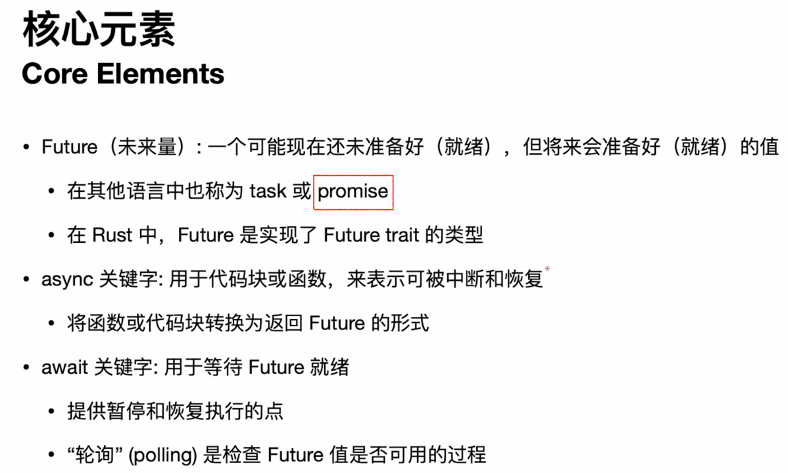
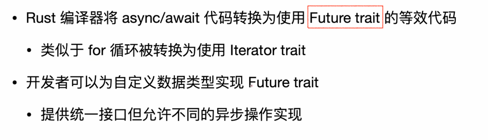
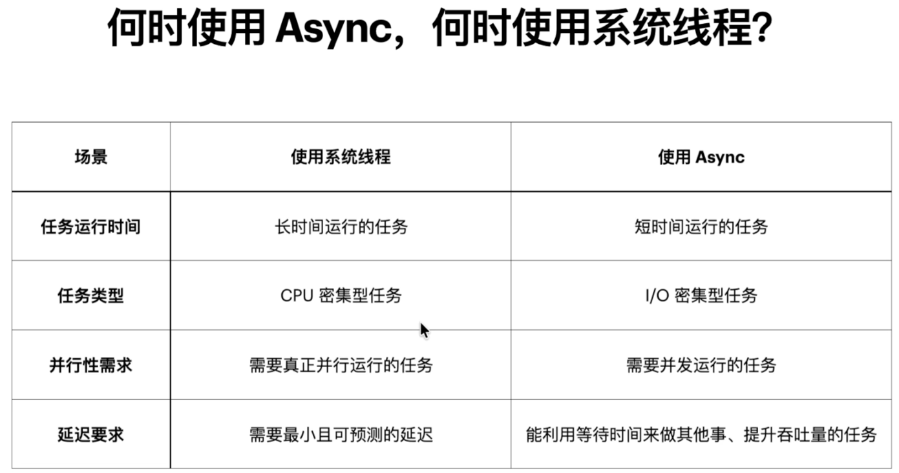
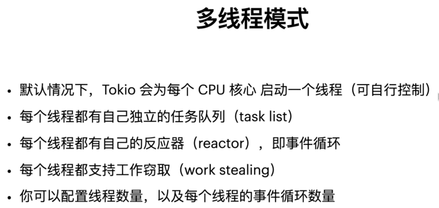

# Async





std::future::Future; 这个future trait。

异步函数在执行时间比较长的IO操作的时候，不会阻塞当前线程，在等待的同时线程可以执行其它的任务。

```rust
use trpl::Html;

// main函数正常不能被标记为async。
// 异步代码需要一个异步运行时，main函数可以初始化运行时，但并不是运行时
#[tokio::main]
async fn main() {
    let url = "https://www.baidu.com/";
    let title = page_title(url).await.unwrap();

    println!("title: {title}"); // title: 百度一下，你就知道

}

// async说明这个函数是一个异步函数
async fn page_title(url: &str) -> Option<String> {
    let response = trpl::get(url).await;
    let response_text = response.text().await;

    Html::parse(&response_text)
        .select_first("title")
        .map(|title_element| title_element.inner_html())
}
```

`#[tokio::main]`  注解的原理是将main函数重写一下，重写成一个普通的main函数，但在main函数内部初始化一个异步运行时，类似如下main函数代码：
```rust
// 普通main函数，但在main函数内部嵌入了一个async block
fn main() {
    // 明确初始化一个异步运行时
    trpl::run(
        async {
            let url = "https://www.baidu.com/";
            let title = page_title(url).await.unwrap();

            println!("title: {title}"); // title: 百度一下，你就知道
        }
    )
}
```

没法真正的将main函数标记为 async 。

# 系统线程 VS 异步



# Tokio

## 单线程模式

```rust
use tokio::runtime::Runtime;
use trpl::{Html};

fn main() {
    let url = "https://www.baidu.com";

    let runtime: Runtime = tokio::runtime::Builder::new_current_thread()
        .enable_all()
        .build()
        .unwrap();

    runtime.block_on(page_title(url));
}

async fn page_title(url: &str) {
    let response = trpl::get(url).await;
    let response_text = response.text().await;

    let title = Html::parse(&response_text)
        .select_first("title")
        .map(|title_element| title_element.inner_html());
    println!("title: {}", title.unwrap());
}
```

如果不用对runtime有精细的配置，也可以使用宏：
```rust
// flavor = "current_thread") 指定单线程模式
#[tokio::main(flavor = "current_thread")]
async fn main() {
    let url = "https://www.baidu.com";
    page_title(url).await;
}

async fn page_title(url: &str) {
    let response = trpl::get(url).await;
    let response_text = response.text().await;

    let title = Html::parse(&response_text)
        .select_first("title")
        .map(|title_element| title_element.inner_html());
    println!("title: {}", title.unwrap());
}
```
第二种方式是一种语法糖，编译器还是会将其转换成第一种的方式。


## 多线程模式


窃取 指的是如果某个thread没有任务，而其它线程又被任务阻塞，那么空闲的线程可以从被阻塞的线程中窃取任务执行。

`#[tokio::main]` 默认就是多线程模式
```rust
// 默认就是多线程模式
#[tokio::main]
async fn main() {
    let url = "https://www.baidu.com";
    page_title(url).await;
}
```

明确指定runtime参数
```rust
use trpl::{Html};

fn main() {
    let url1 = "https://www.baidu.com";
    let url2 = "https://www.bilibili.com";

    let runtime = tokio::runtime::Builder::new_multi_thread()
        .worker_threads(10)
        .thread_stack_size(5 * 1024 * 1024)
        .event_interval(20)
        .max_blocking_threads(256)
        .enable_all()
        .build()
        .unwrap();

    runtime.block_on(page_title(url1));
    runtime.block_on(page_title(url2));
}

async fn page_title(url: &str) {
    let response = trpl::get(url).await;
    let response_text = response.text().await;

    let title = Html::parse(&response_text)
        .select_first("title")
        .map(|title_element| title_element.inner_html());
    println!("title: {}", title.unwrap());
}

```