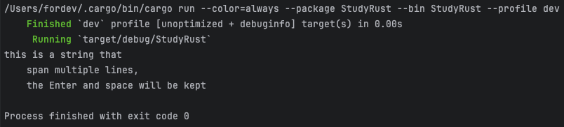
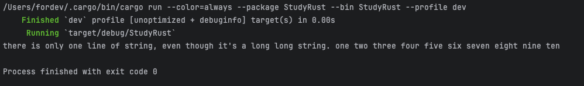
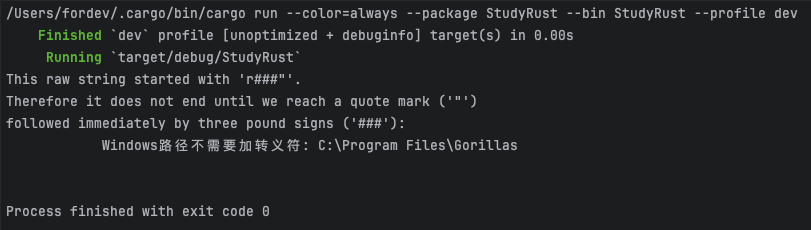
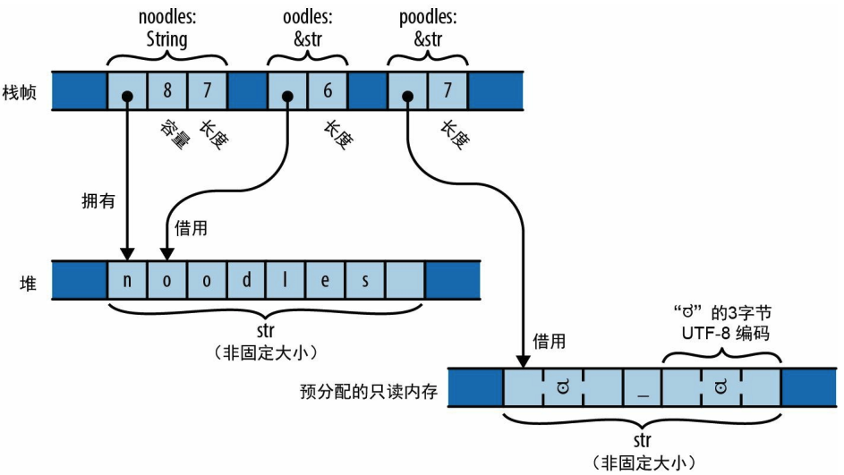

## 字符串

### 字符串字面量

一个跨越多行的字符串：

```rust
fn main() {
    let str1 = "this is a string that
    span multiple lines,
    the Enter and space will be kept";

    println!("{}", str1);
}
```

字符串字面量中的**换行符和空格是字符串的一部分**，因此会包含在输出中：


如果字符串的一行以**反斜杠**结尾，那么就会丢弃其后的换行符和前导空格：

```rust
fn main() {
    let str = "there is only one line of string, \
    even though it's a long long string. \
    one two three four five six seven eight nine ten";

    println!("{}", str);
}
```

打印出单行文本：



#### 原始字符串

```rust
fn main() {
    let str = 
        r###"This raw string started with 'r###"'.
Therefore it does not end until we reach a quote mark ('"')
followed immediately by three pound signs ('###'):
            Windows路径不需要加转义符: C:\Program Files\Gorillas
"###;

    println!("{}", str);
}
```

打印结果：


原始字符串不要求井号的具体数量，只要求前后数量一致，且不会和内容相混淆，可以根据需要添加任意多个井号。

### 字节串

字节串是 u8 值（字节）的切片而不是 Unicode 文本：

```rust
fn main() {
    let byte_str: &[u8] = b"abc";

    println!("{}", byte_str[0]); // 97
    println!("{}", byte_str[1]); // 98
    println!("{}", byte_str[2]); // 99
}
```

字节串**不能包含任意 Unicode 字符**，它们只能使用 ASCII 和 \xHH 转义序列。

### 字符串类型

字符串不是以char数组的形式存储在内存中，而是使用了 UTF-8（可变宽度编码）的形式。**字符串中的每个ASCII字符都会存储在单字节中，而其他字符会占用多字节**。

```rust
let noodles = "noodles".to_string();
let oodles = &noodles[1..];
let poodles = "ಠ_ಠ";
```



`String`有一个可以调整大小的缓冲区，其中包含UTF-8文本。缓冲区是在**堆**上分配的，因此它可以根据需要来**调整大小**。

可以将String视为`Vec<u8>`，它可以保证包含格式良好的 UTF-8。

`&str`是对别人拥有的一系列 UTF-8 文本的引用，即它“**借用**”了这个文本。可以认为`&str`就是`&[u8]`。

字符串字面量是指预分配文本的&str，它通常与程序的机器码一起存储在**只读**内存区，在程序开始执行时就已创建并一直存续到程序退出。

String 或 &str 的 `.len()` 方法会返回其长度。这个长度以**字节**而不是字符为单位。

**字符串支持 == 运算符和 != 运算符**。如果两个字符串以相同的顺序包含相同的字符（无论是否指向内存中的相同位置），就认为它们是相等的。

## 类型别名

用 type 关键字来为现有类型声明一个新名称：

```rust
fn main() {
    // 自定义一种新的类型，类型的名字首字母要大写，且用驼峰
    type OneKBuf = [u8; 1024];

    let buffer: OneKBuf = [0; 1024];

    println!("{:?}", buffer);
}
```

