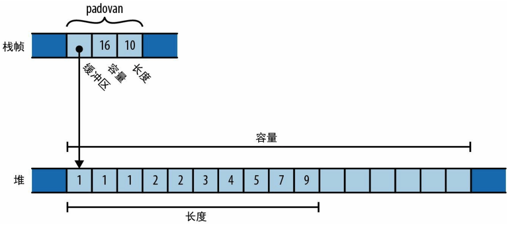
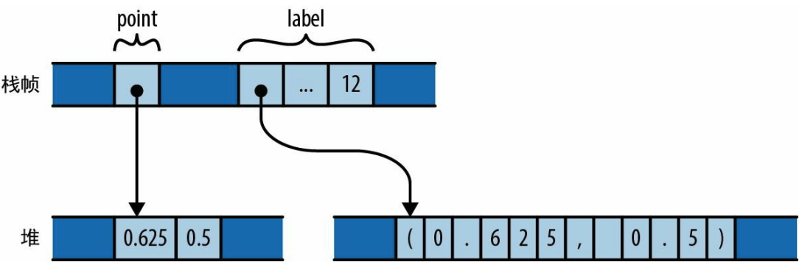
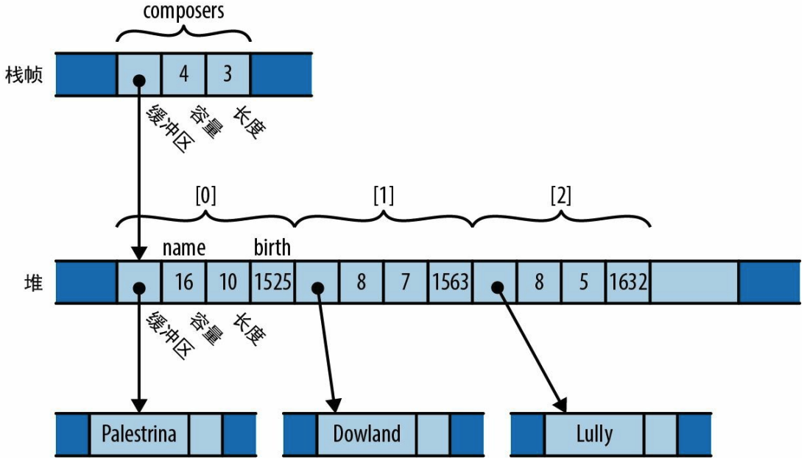
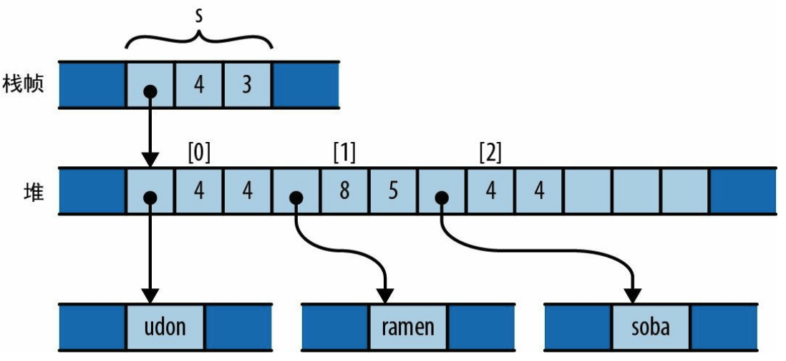
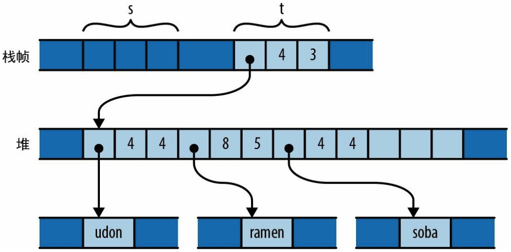
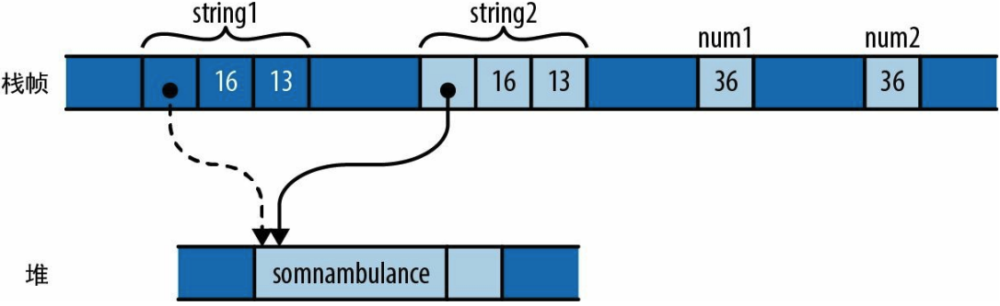
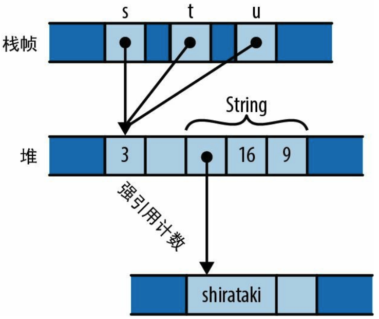
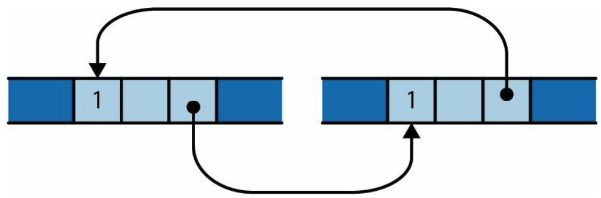

内存管理的两个问题：

1. 内存要及时释放。

2. 对象释放后，不能继续使用指向它的指针，这是未定义行为，会导致崩溃和安全漏洞。

现代主流编程语言的两个阵营：

1. “安全优先”阵营会通过**垃圾回收**机制来管理内存，在所有指向对象的可达指针都消失后，**自动**释放对象。它通过简单地保留对象，直到再也没有指向它们的指针为止，来消除悬空指针。几乎所有现代语言都属于这个阵营，从 Python、JavaScript 和 Ruby 到 Java、C#。
   但是依赖垃圾回收，就意味着放弃了对于释放对象时机的**精准**控制。
2. “控制优先”阵营会让你自己负责释放内存。程序的内存消耗完全掌握在你的手中，但避免悬空指针也完全成了你的责任。C 和 C++ 是这个阵营中仅有的两种主流语言。

Rust的目标是**既安全又高效**，所以这两种妥协都是无法接受的。

Rust通过限制程序使用指针的方式在混沌中建立足够的秩序，以便让Rust的**编译期**检查器有能力验证程序中是否存在内存安全错误：悬空指针、重复释放、使用未初始化的内存等。Rust**编译器**能证明你的代码在安全地使用各个指针。

## 所有权

拥有对象意味着可以决定何时释放此对象：当销毁拥有者时，它拥有的对象也会随之销毁。

在Rust中，所有权这个概念内置于语言本身，并通过**编译期检查**强制执行。每个值都有决定其生命周期的**唯一**拥有者。当拥有者被释放时，它拥有的值也会同时被释放，在 Rust 术语中，释放的行为被称为丢弃（**drop**）。

### 例子一

变量`padovan`的类型为 `Vec<i32>`，在内存中，padovan的最终值如下图所示：



保存padovan指针、容量和长度的字都直接位于所在函数的栈帧中，只有向量的缓冲区才分配在堆上。padovan变量**拥有**保存其元素的缓冲区，当变量padovan在函数末尾超出作用域时，程序将会丢弃padovan向量，进而此缓冲区也会一起被丢弃。

### 例子二

Box是指向存储在堆上的T类型值的指针。可以调用`Box::new(v)`分配一些堆空间，将值v移入其中，并返回一个指向该堆空间的Box。

```rust
{
    let point = Box::new((0.625, 0.5)); // 在此分配了point
    let label = format!("{:?}", point); // 在此分配了label
    assert_eq!(label, "(0.625, 0.5)");
} 
```

内存结构图如下：



栈帧本身包含变量point和label，其中每个变量都指向其拥有的堆中内存。当丢弃它们时，它们拥有的堆中内存也会一起被释放。

### 例子三

```rust
struct Person { name: String, birth: i32 }

let mut composers = Vec::new();
composers.push(Person { name: "Palestrina".to_string(),
												birth: 1525 });
composers.push(Person { name: "Dowland".to_string(),
												birth: 1563 });
composers.push(Person { name: "Lully".to_string(),
												birth: 1632 });
for composer in &composers {
	println!("{}, born {}", composer.name, composer.birth);
}
```

更复杂的所有权树：



当变量composers被丢弃时，整棵所有权树会被一起丢弃。

### 总结

每个值都有一个**唯一**的拥有者，拥有者及其拥有的那些值形成了一棵树。值的拥有者是值的父节点，值拥有的值是值的子节点。每棵树的**总根**都是一个变量，当该变量超出作用域时，整棵树都将随之消失。

Rust 的**单一拥有者规则**将禁止任何可能让它们排列得比树结构更复杂的可能性。Rust程序中的每一个值都是某棵树的成员，树根是某个变量。

**Rust程序不需要使用free和delete来丢弃值**。在Rust中丢弃一个值的方式就是从所有权树中移除它，Rust会确保正确地丢弃该值及其拥有的一切。

像整数、浮点数和字符这样的非常简单的类型，不受所有权规则的约束。这些称为**Copy**类型。


## 移动

在Rust中，像为变量赋值、将其传给函数或从函数返回这样的操作都不会复制值，而是会**移动**值。

**源会把值的所有权转移给目标并变回未初始化状态，改由目标变量来控制值的生命周期**。

```rust
let s = vec!["udon".to_string(), "ramen".to_string(), "soba".to_string()];
let t = s;
let u = s;
```

执行完`s`初始化之后的内存结构：



在初始化`t`之后，程序的内存如图：



赋值会将值的所有权从`s`转移给`t`，而`s`会回到未初始化状态。现在`t`拥有了此向量。

当执行`let u = s`时，由于s是未初始化变量，因此编译器会拒绝此代码并报告如下错误：

```rust
error: use of moved value: `s`
|
7 | let s = vec!["udon".to_string(), "ramen".to_string(), "soba".to_string()];
| - move occurs because `s` has type `Vec<String>`,
| which does not implement the `Copy` trait
8 | let t = s;
| - value moved here
9 | let u = s;
| ^ value used here after move
```

Rust中的赋值操作开销极低（程序只需将向量的三字标头从一个位置移到另一个位置即可，拥有值的堆存储不需要移动），而且所有权始终是明确的（程序不需要引用计数或垃圾回收就能知道何时释放向量元素和字符串内容）。

### 一些移动例子

```rust
let mut s = "Govinda".to_string();
s = "Siddhartha".to_string(); // 在这里丢弃了值"Govinda"
```

```rust
let mut s = "Govinda".to_string();
let t = s; // t从s接手了所有权
s = "Siddhartha".to_string(); // 这里什么也没有丢弃
```

```rust
let x = vec![10, 20, 30];
if c {
	f(x); // ……可以在这里移动x
} else {
	g(x); // ……也可以在这里移动x
}
h(x); // 错误：只要任何一条路径用过它，x在这里就是未初始化状态
```

```rust
// 禁止在循环中进行变量移动
let x = vec![10, 20, 30];
while f() {
	g(x); // 错误：x已经在第一次迭代中移动出去了，在第二次迭代中，它成了未初始化状态
}
```

```rust
// 除非在下一次迭代中明确赋予 x 一个新值
let mut x = vec![10, 20, 30];
while f() {
	g(x); // 从x移动出去了
	x = h(); // 赋予x一个新值，所以不会报错
}
e(x);
```

```rust
fn main() {
    let v: Vec<String> = vec![0.to_string(), 1.to_string(), 2.to_string()];
    let num = v[1]; // 不能将向量中的元素直接赋值给变量num
}
/*
cannot move out of index of `Vec<String>` [E0507]
move occurs because value has type `String`, which does not implement the `Copy` trait
Help: consider borrowing here
Help: consider cloning the value if the performance cost is acceptable

如果vector中的元素是i32这种简单类型，就不会报这个错误了。
 */
```

```rust
// 像 Vec 这样的集合类型可以在循环中消耗所有元素：
fn main() {
    let v: Vec<String> = vec![0.to_string(), 1.to_string(), 2.to_string()];
  	// for 循环的内部机制会获取向量的所有权并将其分解为元素
    for mut s in v {
        s.push('!'); // v中的元素在for循环中被move
        println!("{}", s); 
    }
  	// for循环结束后，变量v是未初始化状态
    println!("{}", v.len()); // 这行代码会报错：Value used after being moved
}
```

## Copy类型

String 进行赋值和用 i32 进行赋值时内存中有什么不同：

```rust
// String 赋值会移动值
let string1 = "somnambulance".to_string();
let string2 = string1;

// 而用 i32 赋值会复制值
let num1: i32 = 36;
let num2 = num1;  // num1仍然可用
```



i32 只是内存中的几字节，它不拥有任何**堆**资源，也不会实际依赖除本身的字节之外的任何内存。

对 Copy 类型的值进行赋值会复制这个值，而不会移动它。**赋值的源仍会保持已初始化和可用状态**， 并且具有与之前相同的值。把 Copy 类型传给函数和构造器的行为也是如此。

标准的 Copy 类型包括所有机器整数类型和浮点数类型、char 类型和 bool 类型。Copy 类型的元组或固定大小的数组本身也是 Copy 类型。

只有那些可以通过简单地复制位来复制其值的类型才能作为 Copy 类型。String 不是 Copy 类型，因为它拥有从堆中分配的缓冲区。

自定义的结构体默认不是Copy类型：
```rust
fn main() {    
    let l1 = Label { 
        number: 100 
    };
    let l2 = l1;
    println!("{}", l1.number); // 报错： Value used after being moved
    
}

// 结构体默认不是Copy类型，即使它所有的字段都是Copy类型
struct Label {
    number: u32
}
```

如果结构体的所有字段本身都是 Copy 类型，那么可以通过将属性`#[derive(Copy, Clone)]`放置在此定义之上来创建 Copy 类型：

```rust
fn main() {
    let l1 = Label {
        number: 100
    };
    let l2 = l1;
    println!("{}", l1.number); // 已声明Label是Copy类型，这行可正常执行

}

#[derive(Copy, Clone)]
struct Label {
    number: u32
}
```

但如果试图在一个其字段不全是 Copy 类型的结构体上这样做，仍然行不通。

## Rc 与 Arc

在某些情况下，很难为每个值都找到具有所需生命周期的**单个**拥有者，你会希望某个值只要存续到每个人都用完它就好。对于这些情况，Rust 提供了引用计数指针类型 Rc 和 Arc。Arc 是原子引用计数(atomic reference count) 的缩写。

Rc 类型和 Arc 类型非常相似，它们之间唯一的区别是 Arc 可以安全地在线程之间直接共享。但Rc的性能更好。

```rust
use std::rc::Rc;

// Rust能推断出所有这些类型，这里写出它们只是为了讲解时清晰
let s: Rc<String> = Rc::new("shirataki".to_string());
let t: Rc<String> = s.clone();
let u: Rc<String> = s.clone();
```

对于任意类型 T，Rc 值是指向**附带引用计数**的在堆上分配的 T 型指针。克隆一个 Rc 值并不会复制 T，相反，它只会**创建另一个指向它的指针**并**递增引用计数**。



当丢弃最后一个现有 Rc 时，Rust 也会丢弃 String。

**Rc 指针拥有的值是不可变的！！！**不能通过s指针修改字符串的值。

Rust 确保不会有任何值是既共享又可变的。Rust 假定 Rc 指针的引用目标 通常都可以共享，因此就不能是可变的。

循环引用计数导致这些对象都没机会释放：



以这种方式在 Rust 中造成值的泄漏是有可能的，但这种情况非常少见。只要不在某个时刻让旧值指向新值，就无法建立循环。这显然要求旧值是可变的。由于 Rc 指针会保证其引用目标不可变，因此通常不可能建立这种循环引用。