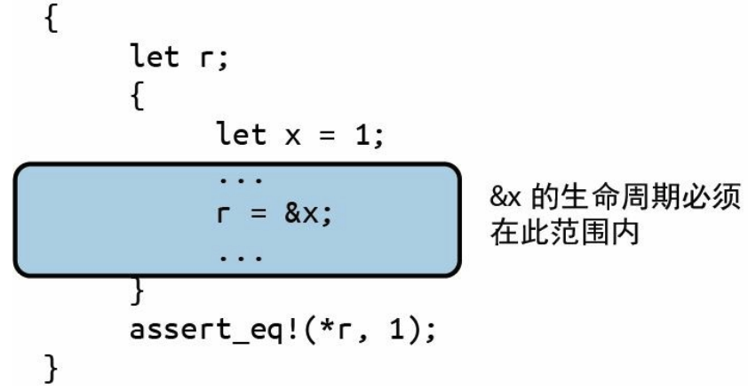
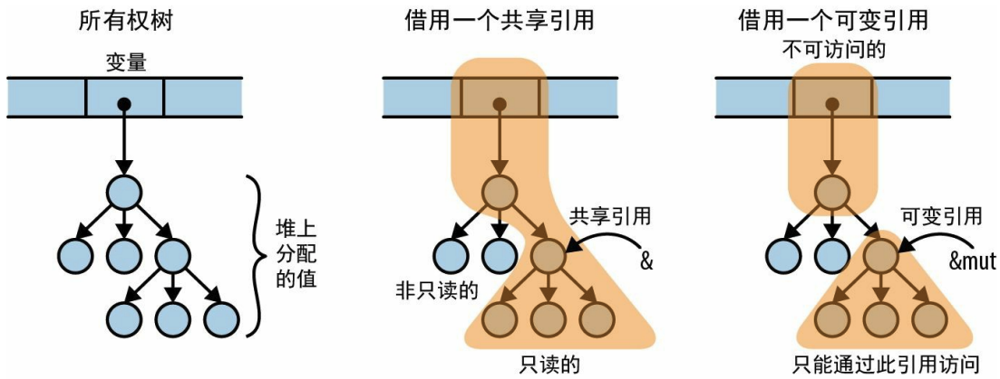
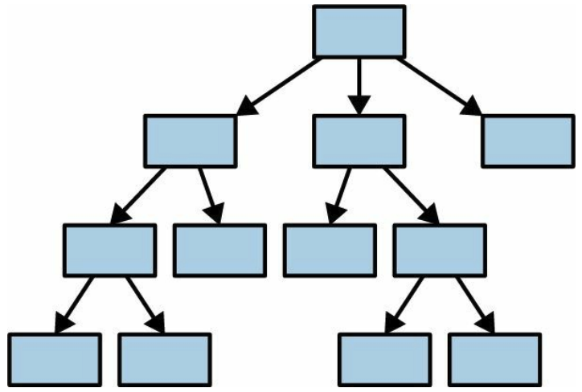

# 引用

引用是**非拥有**型指针，它对引用目标的生命周期毫无影响。但**引用的生命周期绝不能超出其引用的目标**。

引用是机器级别的**地址**。Rust把创建对某个值的引用称为**borrow**那个值。

下面的代码运行会报错：
```rust
use std::collections::HashMap;

type Table = HashMap<String, Vec<String>>;

fn main() {
    let mut table = Table::new();

    table.insert("Gesualdo".to_string(),
                 vec!["many madrigals".to_string(),
                      "Tenebrae Responsoria".to_string()]);
    table.insert("Caravaggio".to_string(),
                 vec!["The Musicians".to_string(),
                      "The Calling of St. Matthew".to_string()]);
    table.insert("Cellini".to_string(),
                 vec!["Perseus with the head of Medusa".to_string(),
                      "a salt cellar".to_string()]);
  
    // 当调用show(table)时，整个table结构被移动到了函数中，变量table变成了未初始化状态。
    show(table);  // value moved here

    println!("{}", table["Cellini"][0])  // Value used after being moved
}

fn show(table: Table) {
    for (artist, works) in table {
        println!("works by {}:", artist);
        for work in works {
            println!("  {}", work);
        }
    }
}

// 由于移动的语义特点，我们只是想把它打印出来，却完全破坏了整个结构！！！！！！
```

处理这个问题的正确方式是使用引用。**引用能让你在不影响其所有权的情况下访问值**。

有以下两种类型的引用：

1. **共享引用（&T）**允许你读取但不能修改其引用目标，但可以同时拥有**任意数量**的对特定值的共享引用。共享引用是 Copy 类型。
2. **可变引用（&mut T）**允许你读取和修改值，一旦一个值拥有了可变引用，就无法再对该值创建其他任何种类的引用了。

只要存在对一个值的共享引用，**即使是它的拥有者也不能修改它**，该值会被锁定。

如果有某个值的可变引用，那么它就会独占对该值的访问权，在可变引用消失之前，**即使拥有者也根本无法使用该值**。

确保**共享和修改保持完全分离**！！！

将show函数的入参类型修改成Table变量的共享引用：

```rust
use std::collections::HashMap;

type Table = HashMap<String, Vec<String>>;

fn main() {
    let mut table = Table::new();

    table.insert("Gesualdo".to_string(),
                 vec!["many madrigals".to_string(),
                      "Tenebrae Responsoria".to_string()]);
    table.insert("Caravaggio".to_string(),
                 vec!["The Musicians".to_string(),
                      "The Calling of St. Matthew".to_string()]);
    table.insert("Cellini".to_string(),
                 vec!["Perseus with the head of Medusa".to_string(),
                      "a salt cellar".to_string()]);

    show(&table); // 传递table的共享引用，只是将table变量借给show函数一会

    // table变量仍是整个结构的拥有者，可以正常使用table变量
    println!("{}", table["Cellini"][0])
}

// 函数参数类型改成共享引用
fn show(table: &Table) {
    // 由于table参数是对Table的共享引用，所以artist和works就变成了对其key和value的共享引用
    // artist从String变成了&String，而works从Vec<String>变成了&Vec<String>
    for (artist, works) in table {
        println!("works by {}:", artist);
        // work现在是&String
        for work in works {
            println!("  {}", work);
        }
    }
}
```

## 简单的引用示例

```rust
fn main() {
    let x: i32 = 100;
    let r: &i32 = &x;

    println!("{}", *r == x); // *r 显示的解引用

    let mut y: i32 = 66;
    let m: &mut i32 = &mut y; // 通过 &mut 创建可变引用

    *m += 100;  // 通过引用修改变量的值
    println!("{}", y);
}
```

## . 运算符对其左操作数隐式解引用

```rust
fn main() {
    let mut p = Person {
        name: "Chris".to_string(),
        age: 50,
    };

    // 注意这里q变量是引用，下面通过q引用访问变量并没有显示使用 *q 解引用
    let q = &mut p;
    q.age += 1;
    q.name.push_str(" Kang");
    println!("name: {}, age: {}", q.name, q.age); // name: Chris Kang, age: 51

    // 显示解引用, 注意要加()，因为 . 运算符的优先级高于 *
    (*q).age += 1;
    (*q).name.push_str(" test");
    println!("name: {}, age: {}", p.name, p.age); // name: Chris Kang test, age: 52
}

struct Person {
    name: String,
    age: i32,
}
```

在进行方法调用时，`.`运算符也可以隐式borrow对其左操作数的引用：

```rust
fn main() {
    let v: Vec<i32> = vec![3, 2, 4, 1, 5, 9, 7];
    // v不是引用变量，但 .运算符 可以隐式borrow它的引用
    println!("capacity: {}, len: {}", v.capacity(), v.len());
    
    // capacity 和 len 两个方法的定义如下，这两个方法接受的都是引用类型变量
    // pub const fn capacity(&self) -> usize
    // pub const fn len(&self) -> usize

    // 显示使用引用变量
    println!("capacity: {}, len: {}", (&v).capacity(), (&v).len());
}
```

`.`运算符可以支持隐式的**借用**和**解引用**。即当`.`左边是一个非引用变量时，你可以提供一个引用变量（隐式解引用）。当`.`左边是一个引用变量时，你可以提供一个普通变量（隐式borrow）。

## 引用的引用

```rust
fn main() {
    let point = Point {
        x: 3,
        y: 4
    };
    let r: &Point = &point;
    let rr: &&Point = &r;
    let rrr: &&&Point = &rr;

    // .运算符 会连续解引用多层次的引用
    println!("x: {}, y: {}", rrr.x, rrr.y)
}

struct Point {
    x: i32,
    y: i32
}
```

比较运算符也能自动解引用之后再比较：

```rust
fn main() {
    let x = 100;
    let y = 100;
    let rx = &x;
    let rrx = &rx;

    let ry = &y;
    let rry = &ry;

    // 隐式多层级解引用
    println!("{}", rrx == rry)  // true
}
```

## 引用安全

如果有一个变量 x，那么对 x 的引用的生命周期不能超出 x 本身：



如果没有这个限制，那引用变量`r`会变成一个悬空指针。

### 引用作为函数参数

```rust
// 定义一个全局静态变量引用，它在程序启动时就会被创建并一直存续到程序终止。
static mut STASH: &i32 = &128;

// 方法参数用 'static 明确声明了参数的lifetime，限制test只能接受一个全局静态变量的引用作为参数
fn test_lifetime(p: &'static i32) {
    // 因为可变静态变量不是线程安全的，只能在unsafe块中访问它
    unsafe {
        STASH = p
    }
}

// 默认函数参数是小生命周期，一个恰好涵盖对函数调用的生命周期
// 只要看到函数签名，Rust就知道它不会将p保存在生命周期可能超出本次调用的任何地方
fn test_short_lifetime(p: &i32) {
    // p 引用变量是小生命周期，不能将其赋值给STASH全局静态变量
    // unsafe {
    //     STASH = p  // lifetime may not live long enough
    // }
}

// 明确声明函数参数是小生命周期，与test_short_lifetime函数的定义等价
fn test_short_lifetime2<'a>(p: &'a i32) {
    // <'a> 的意思是“对于任意生命周期 'a”，这个“任意生命周期”参数可以省略，而且也很难看
    // Parameter types contain explicit lifetimes that could be elided 
}

static NUMBER: i32 = 100;

fn main() {
    unsafe {
        println!("{}", *STASH);  // 128
        
        test_lifetime(&NUMBER);  // 在函数中修改引用变量的值

        println!("{}", *STASH);  // 100
    }

    let number = 500;

    // number变量生命周期不够，不能传给test_lifetime函数
    // test_lifetime(&number); // `number` does not live long enough

    // test_short_lifetime可以接受number变量的引用作为参数
    test_short_lifetime(&number);
}
```

### 函数的返回值

```rust
fn main() {
    let s;
    {
        let parabola = [9, 4, 1, 0, 1, 4, 9];
        s = smallest(&parabola);
    }
    // assert_eq!(*s, 0);  // 错误：指向了已被丢弃的数组的元素

    // 向量的所有者是parabola变量，0对象是属于parabola变量对象树中的。parabola变量销毁时，整棵树都被销毁。
    // s引用是指向0对象，s引用在parabola变量的对象树销毁之后不能存在。
}

fn smallest(v: &[i32]) -> &i32 {
    let mut s = &v[0];
    for r in &v[1..] {
        if *r < *s {
            s = r;
        }
    }
    s
}
```

## 共享与可变

在共享引用的整个生命周期中，它引用的目标会保持只读状态，即不能对引用目标赋值或将值移动到别处。

一个变量的可变引用和共享引用的生命周期不能重叠。

每种引用都会影响到我们可以对“**到引用目标从属路径上的值**”以及“**从引用目标可间接访问的值**”所能执行的操作：



Rust 更喜欢让指针、所有权和数据流单向通过系统：

