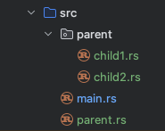

# 模块

Java 的 package 是「文件级」的模块化，和目录结构强绑定；Rust 的 module 是「代码级」的模块化，与文件目录弱绑定，可灵活嵌套。

在`main.rs`文件中定义一个名叫`parent`的 module，`parent`模块中还嵌套了子模块：

```rust
// main.rs文件中定义一个module
mod parent {
    pub struct Parent {
        // name 和 age两个字段必须声明pub，否则在模块外无法访问
        // 如果不加pub，那只能在模块内访问
        pub name: String,
        pub age: i32,
    }
    // public方法，模块外可以访问
    pub fn public_function() {
        println!("public function");
    }
    // private方法，模块外不能访问
    fn private_function() {
        println!("private function");
        // 虽然child1没有被声明为pub，但可以在父模块中调用它
        child1::child1_function();
    }

    // 嵌套子模块
    mod child1 {
        pub fn child1_function() {
            println!("child1 function");
        }
    }

    pub mod child2 {
        use crate::parent::private_function;

        pub fn child2_function() {
            println!("child2 function");
            // 子module可以调用父module中的私有方法
            private_function();
        }
    }
}
fn main() {
    // 调用模块中的public方法
    parent::public_function();

    let obj = parent::Parent { name: "test".to_string(), age: 22 };
    println!("name: {}, age: {}", obj.name, obj.age);

    // 不能直接调用模块中的private方法
    // parent::private_function();  Function `private_function` is private

    // 调用子模块中的public方法
    parent::child2::child2_function();
    // child1 没有声明为pub，不能在parent模块外调用
    // parent::child1::child1_function();  // Module `child1` is private
}
```

任何未标记为 pub 的内容都是私有的，只能在定义它的模块及其**任意子模块**中使用。

### pub 和 pub(crate) 的区别

1. `pub`是全局公有，即项目内所有模块和外部依赖都能访问。
2. `pub(crate)`是在当前crate内公有，仅在自己的 crate 内所有模块能访问，外部依赖无法看到。

### 父模块声明子模块

在Rust中，**一个模块的定义是放在其父模块中**，这跟Java有明显的区别（Java是一个类文件自己声明自己所属的package）。

在 Rust 中，模块形成一棵树， mod 语句是在 父节点 中声明 子节点。

**main.rs 或 lib.rs 是根模块！！！！！！！ **

## 单独文件中的模块

将所有模块代码放在同一个文件中是很痛苦的！！！

当 Rust 看到 `mod parent;`这行代码时，会同时检查 `parent.rs` 和 `parent/mod.rs`这两个文件，如果两个文件都不存在，或者都存在，就会报错。

将上述各个模块分别放在独立的文件中，可以有两种方式。

方式一：

```
crate (根模块，即 main.rs 或 lib.rs)
└── parent module  ← 在 main.rs 中声明
    └── child1 module   ← 在 /parent/mod.rs 文件中声明
        └── child1_function   ← 在 /parent/child1.rs 文件中声明
    └── child2 module   ← 在 /parent/mod.rs 文件中声明
    		└── child2_function   ← 在 /parent/child2.rs 文件中声明
```


方式二：

```
crate (根模块，即 main.rs 或 lib.rs)
└── parent module  ← 在 main.rs 中声明
└── child1 module   ← 在 /parent.rs 文件中声明, parent.rs跟main.rs平级
    └── child1_function   ← 在 /parent/child1.rs 文件中声明
└── child2 module   ← 在 /parent.rs 文件中声明，parent.rs跟main.rs平级
    └── child2_function   ← 在 /parent/child2.rs 文件中声明
```



## 导入

```rust
use std::collections::{HashMap, HashSet};   // 同时导入两个模块
use std::fs::{self, File}; 									// 同时导入`std::fs`和`std::fs::File`
use std::io::prelude::*; 										// 导入所有语法项

// 默认情况下，路径是相对于当前模块的

use crate::parent::private_function;        // 显式导入相对于crate根路径的语法项
// 使用相对于 crate 根而不是当前模块的路径可以更容易地在项目中移动代码
```

## 静态变量 & 常量

模块中可以定义常量和静态变量：

```rust
// 常量的名字都大写
pub const ROOM_TEMPERATURE: f64 = 20.0; 


pub static ROOM_TEMPERATURE: f64 = 68.0; 
```

静态变量与常量几乎是一回事，没有 mut 常量。静态变量可以标记为 mut。

